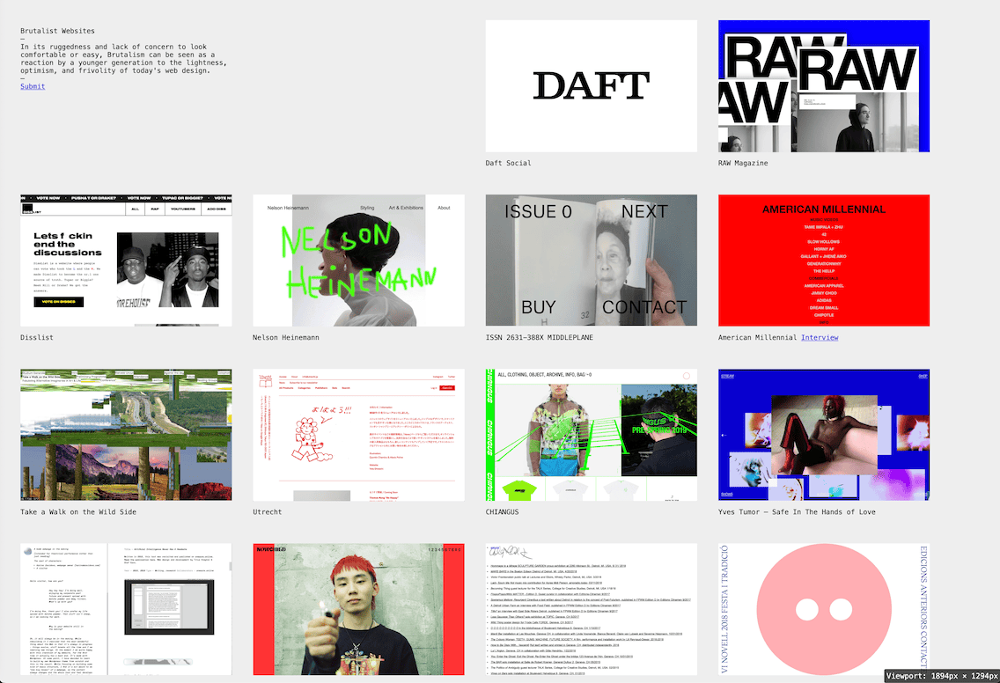

# Viewport Dimensions Toggle


A simple and lightweight bookmarklet that instantly displays the viewport dimensions in any browser. Ideal for web developers, responsive designers, and SEO professionals who need to quickly know the screen dimensions without opening developer tools.



## 🚀 Features

- **Toggle on/off** - Click once to display, click again to hide
- **Discreet position** - Appears in the top right corner of the screen
- **Real-time update** - Dimensions update automatically on resizing
- **Universal** - Works on all websites
- **Lightweight** - No dependencies, minimalist code
- **No installation** - Simple favorite in your browser

## 📋 Setup

1. **Create a new bookmark** in your browser
   - Right-click on the bookmarks bar
   - Select "Add Bookmark" or "Add Page"

2. **Name the bookmark** (e.g., "📐 Viewport Dimensions")

3. **Copy and paste the following code** into the URL/Address field :
   ```javascript
   javascript:(function(){var id='viewport-size-display',d=document.getElementById(id);if(d){window.removeEventListener('resize',d._updateFn);d.remove();}else{d=document.createElement('div');d.id=id;d.style.cssText='position:fixed;bottom:0;right:0;background:rgba(0,0,0,0.7);color:white;padding:5px;z-index:9999;font-size:14px;border-radius:3px;';d._updateFn=function(){d.innerHTML='Viewport: '+window.innerWidth+'px × '+window.innerHeight+'px';};d._updateFn();window.addEventListener('resize',d._updateFn);document.body.appendChild(d);}})();
	 ```

4. **Save the bookmark**

## 🖥️ Usage

1. Navigate to any webpage
2. Click on the "Viewport Dimensions" bookmark to display the dimensions
3. Click again to hide them

## 🔧 Customization

You can easily modify the source code to:

- Change the display position
- Modify colors and style
- Add additional information

## 💡 Use Cases

- **Responsive development** - Instantly check CSS breakpoints
- **Web design** - Ensure your designs adapt correctly
- **Mobile debugging** - Test responsiveness on different devices
- **SEO optimization** - Check mobile compatibility

## 🤝 Contribution

Contributions are welcome! Feel free to open an issue or submit a pull request.

## 📄 License

This project is licensed under the MIT License - see the [LICENSE](LICENSE) file for details.

## 🔗 Useful links

[My portfolio](https://jblouvet.com)

---

If you find this tool useful, feel free to give it a ⭐ on GitHub!